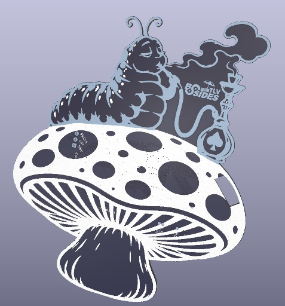
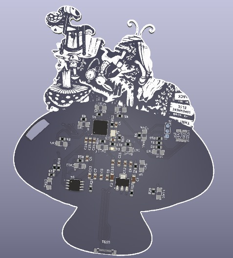
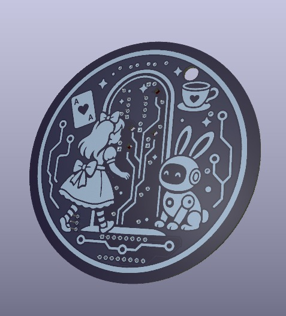

# BSidesTLV 2026 Badge

Everything for the BSidesTLV 2026 badge: two KiCad boards, the RP2040 firmware
that runs on it, and the online puzzle challenge — *Alice in AI Land* — that the
badge is used to play.

<p align="center">
  
</p>

```
index.html         the challenge - static site, served from the repo root
glitch.html        the glitch range - two practice rooms for the badge's quick-glitch layer
styles.css  src/  stages/  assets/
hardware/          KiCad projects (CERN-OHL-S-2.0)
  badge/             "BSidesTLV2026 Alice Controller" - RP2040 handheld, 14 buttons, USB-C
  soldering-kit/     555 + CD4017 LED chaser, the soldering workshop kit
software/          everything that builds the above, but is not served (MIT)
  controller/        RP2040 firmware - enumerates as a DualShock 4
  tools/             slicing and generation, writes into ../assets/
  references/        the source sheets the art was cut from
  legacy/  docs/
```

## The challenge

*Alice in AI Land* is a boulder-pushing puzzle game whose answer is a **program**.
Five stages. The first two are played by hand on the badge. Stage 3 is a
wall: the board is hidden before a human could read it and the move budget
exceeds human input bandwidth, so the only way through is to drive the game with
a script. The game hands you the protocol in stage 2 and dares you to use it.

The simulation is deterministic — 60 ticks/second, one input bitmask per tick,
same seed plus same input trace gives the same outcome byte for byte — which is
what makes it scriptable, replayable and verifiable.

It lives at the repository root — `index.html`, `glitch.html`, `styles.css`,
`src/`, `stages/` and `assets/` — as plain static files. No server, no build step, every path
relative, so it works at a domain root or under `/<repo>/` unchanged.

```
./serve.sh          # http://localhost:8080, the same files Pages serves
npm run verify      # proves both stages are solvable and the range is honest
```

### The glitch range

`glitch.html` is the training ground for the badge as a *fault-injection* tool.
Two rooms, each with levels that start hand-playable and end badge-only:

- **The Rabbit's Pocket Watch** — a fixed tune of buttons to enter inside a
  window. Level 1 is 4 presses in 2 s; level 4 is 12 presses in 600 ms, three
  times what a hand sustains. Record the tune slowly on the badge, speed it up.
- **The Looking-Glass Glitch** — the Queen's guard runs a routine one line per
  tick and one line is the check that turns Alice away. A pulse on `X` whose
  rising edge lands on that line skips it: the door opens and Alice jumps to
  the treasure. Every other landing is reported as a measurement — which line,
  how many lines and milliseconds off — and the last level hides the source so
  the only way in is to sweep the offset and read the guard's reactions.

The page works from the keyboard too, which is how you find out that level 3 of
each cannot be done that way. `software/tools/verify-range.mjs` checks exactly
that: hand levels fit a hand, badge levels do not, and every level is winnable.

[`.github/workflows/pages.yml`](.github/workflows/pages.yml) stages those five
paths and publishes them; set Settings -> Pages -> Source to "GitHub Actions"
once and pushes to `main` that touch the site deploy themselves. It stages
rather than uploading the repo so the artifact stays ~4MB instead of ~34MB —
`hardware/` and `software/` are not part of the site.

ES modules need `http://`, not `file://`. That is the only reason a local
server exists.

- [`software/README.md`](software/README.md) — asset set, slicing tools, how every sprite was cut
- [`software/docs/GAME_DESIGN.md`](software/docs/GAME_DESIGN.md) — stages, tick model, protocol

## The hardware

| Board | What | Key parts |
|---|---|---|
| [`hardware/badge/`](hardware/badge) | "BSidesTLV2026 Alice Controller" v0.4 — the badge itself, and the controller the challenge is played on. D-pad, A/B/X/Y, Start/Select, reset and BootSel, all on one side. Cut to the outline of the Caterpillar's mushroom. | RP2040, W25Q128JVS, AMS1117-3.3, USB-C |
| [`hardware/soldering-kit/`](hardware/soldering-kit) | Through-hole LED chaser for the soldering workshop. Beginner-friendly: DIP, axial, CR2032. | TLC555P, CD4017BE, 4x LED, 500k trimmer |

<table>
<tr>
  <td align="center" width="50%"></td>
  <td align="center" width="50%"></td>
</tr>
<tr>
  <td align="center"><b>badge, back</b> — the RP2040, flash, regulator and the button matrix</td>
  <td align="center"><b>soldering kit</b> — Alice, the White Rabbit and the looking glass</td>
</tr>
</table>

Each project carries its own `production/` directory with the fabrication
package: BOM, positions, designators and IPC netlist.

See [`hardware/README.md`](hardware/README.md) for opening, plotting and
re-fabricating the boards.

## The firmware

[`software/controller/`](software/controller) is the RP2040 firmware. It
presents the badge to a host as a **wired DualShock 4**, which is what makes it
work on an iPhone — iOS only binds controllers it recognizes by USB VID/PID, so
a generic HID gamepad enumerates and is then ignored. Every other host
understands the same report.

```
cd software/controller
mkdir build && cd build
cmake -DPICO_SDK_PATH=/path/to/pico-sdk ..
make -j                              # -> build/controller.uf2
```

Hold `BootSel` while plugging in USB-C, then copy `controller.uf2` onto the
`RPI-RP2` drive that appears. It also builds and runs on a stock Raspberry Pi
Pico, which is the easiest way to try the firmware without a badge.

**Quick glitch.** `SELECT` is a shift key. `SELECT+SL` records a take of button
presses with microsecond timestamps; `SELECT+SR` fires it — a `START` tap as
the trigger, a wait of `offset`, then the take at `speed`. `UP`/`DOWN` scale
the speed from 1/4× to 32×, `LEFT`/`RIGHT` step the offset in milliseconds,
`B` forgets it all. It is what the glitch range is played with. The engine is
plain C with a host test: `make -C software/controller/test`.

Full pin map, chord table and HID report layout:
[`software/controller/README.md`](software/controller/README.md).

## Licences

- **Software** — MIT, see [`LICENSE`](LICENSE). Covers `software/` and the
  Python/Node tooling under `hardware/soldering-kit/tools/`.
- **Hardware** — CERN-OHL-S-2.0, see [`hardware/LICENSE`](hardware/LICENSE).
  Covers both KiCad projects and every gerber, plot and production package
  under `hardware/`.

Third-party symbols and footprints vendored under
`hardware/badge/libs/lcsc/` keep their own upstream terms.

## Contributing

See [`CONTRIBUTING.md`](CONTRIBUTING.md).
